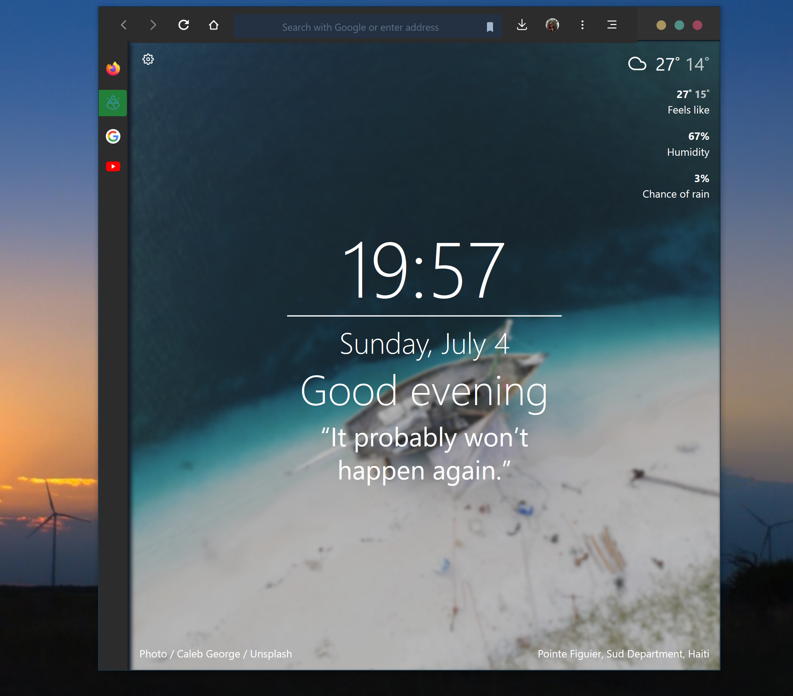

# Firefox Edge
A Firefox config for Edge like view with side tabs.

This is my custom setting of userChrome and TST config based on [FlyingFox](https://github.com/akshat46/FlyingFox).

# Simple install instructions
Better instructions can be found on the FlyingFox git.

## For tree style tab
1. Goto the extension options.
2. Load the CSS file under *Advanced* and *Load from file*.
3. Load the config file on bottom of the page *Development* > *All configs* > *Import* .

## userChrome
1. Open profiles directory:
- type about:config in the URL bar
- *Open folder* on your default profile root directory.
2. Place *chrome* dir and user.js to the profile directory.
